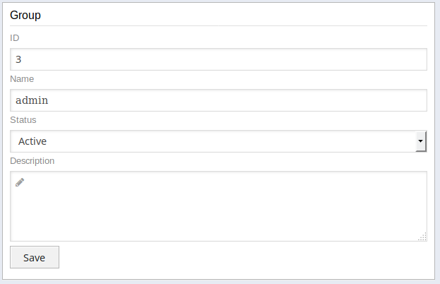
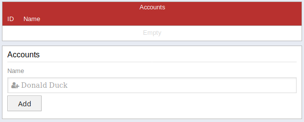

# Groups

In `Groups` you can create, delete and modify the groups. Groups are global for all applications and units. If you want to have application or unit specific permissions you can do so in the group.

## General

### Name

In some cases it makes sense to put some additional information in the group name. In some cases a group is only for a specific unit or application in such a case it could make sense to prefix the group name e.g. `unitname_groupname` or `appname_groupname`. Group names can be changed any time without any side effects. 

### Description

Sometimes it makes sense to provide some additional information for a group. In such a case you can add this in the discription field.

## Permissions

Permissions have the following components which can be combined to either address a wide e.g. range of units, applications or modules or in order to address a very specific combination of those.

### Unit

The unit this permission is set for. Leave empty to address all units

### App

The application this permission is set for. Leave empty to address all applications

### Module

The module this permission is set for. Leave empty to address all modules

### Type

The type is a `module` specific subpart which only should be set if the module is defined in the permission. For further information what kind of types are available for a module please refere to the module specific documentation. Usually it referes to a single page of a module.

### Element

The element is a `module` and `type` specific subpart which only should be set if the `type` is defined in the permission. For further information what kind of elements are available for a module and type please refere to the module specific documentation. Usually it referes to a section on a module page.

### Component

The component is a `module`, `type` and `element` specific subpart which only should be set if the `element` is defined in the permission. For further information what kind of components are available for a module, type and element please refere to the module specific documentation. Usually it referes to a single input or option in a module.

### Permission

The actual permission consists of create (C), read (R), update (U), delete (D), permission (P) options. 

#### Create (C)

This allows a user to create something. Usually a user should also have (R) permission in this case.

#### Read (R)

This allows a user to read/see something.

#### Update (U)

This allows a user to update/modify something. Usually a user should also have (R) permission in this case.

#### Delete (D)

This allows a user to delete/remove something. Usually a user should also have (R) permission in this case.

#### Permission (P)

This allows a user to change permissions. Usually a user should also have (C, R, U, D) permissions because the user could just give himself these permissions anyways. Only selected users should have this permission even if it is only specified for a specific module, type, element or component.

## Accounts

In the accounts section you can see all users that are assigned to this group and you can also add or remove accounts. If you would like to add all users from a different group simply select the group and all the users that are part of this group will be added to this group as well (one time only, there will be **no relation** (e.g. parent/child group) between these two groups).

## Audit Log

In the audit log you can see all the changes of the group.